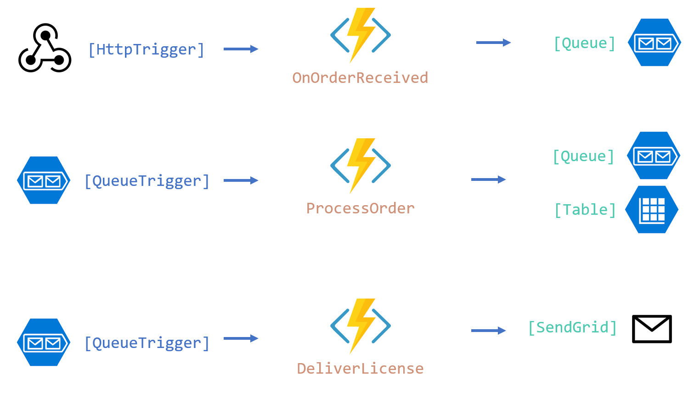

# Introduction

- A sample Azure Functions Pipeline for
    - [Receiving](./OnOrderReceived.cs) an Order ("OnOrderReceived")
    - [Processing](./ProcessOrder.cs) an Order ("ProcessOrder")
        - Create a License
        - Store the License in a Table
        - Add license to a send queue
    - [Deliver](./DeliverLicense.cs) the license as e-Mail ("DeliverLicense")

Created for a demo introduction to Azure Functions